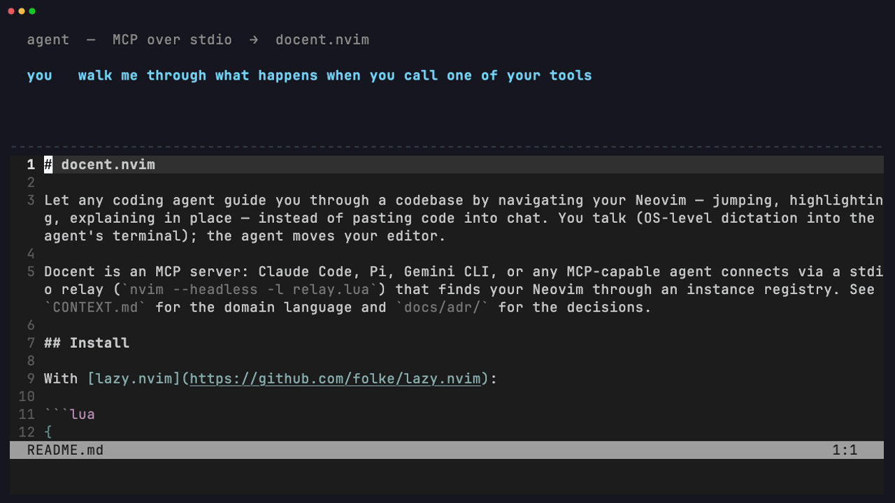

# docent.nvim

Let any coding agent guide you through a codebase by navigating your Neovim by jumping, highlighting, explaining in place instead of pasting code into chat. You talk and the agent shows it in your editor.



*Above: docent giving a tour of docent. The agent queues stops, you pace them with `]v`, a tangent branches a sub-tour and pops back where you left it, and the finished tour asks to be saved. Everything on screen is the real plugin driven over real MCP. `media/demo.tape` re-renders it.*

Docent is an MCP server: Claude Code, Amp, Codex, Pi, or any MCP-capable agent connects via a stdio relay (`nvim --headless -l relay.lua`) that finds your Neovim through an instance registry. See `CONTEXT.md` for the domain language and `docs/adr/` for the decisions.

## Install

With [lazy.nvim](https://github.com/folke/lazy.nvim):

```lua
{
  "KarthikRaju391/docent.nvim",  -- or { dir = "~/code/docent.nvim" } for a local checkout
  opts = {},
  -- opts = { keymaps = { next = "]t", prev = "[t" } }  -- defaults; or keymaps = false
}
```

Or call `require("docent").setup()` yourself. Setup registers this Neovim instance (RPC socket + cwd) in `$XDG_STATE_HOME/docent/instances/` so relays can find it; without setup, agents can't connect.

## Agent registration

Run `:DocentMcpCommand` in Neovim. It prints these lines with your actual install path filled in:

- **Claude Code**: `claude mcp add docent -- nvim --headless -l /path/to/docent.nvim/relay/relay.lua`
- **Amp**: `amp mcp add docent -- nvim --headless -l /path/to/docent.nvim/relay/relay.lua`
- **Codex**: `codex mcp add docent -- nvim --headless -l /path/to/docent.nvim/relay/relay.lua`
- **Pi** (or any client configured by JSON): add to `~/.pi/agent/mcp.json`

  ```json
  { "mcpServers": { "docent": {
      "command": "nvim",
      "args": ["--headless", "-l", "/path/to/docent.nvim/relay/relay.lua"] } } }
  ```

Use an absolute path to the `nvim` binary if your agent launches with a stripped `PATH` (Pi and Codex do). `:DocentMcpCommand` already emits one. Check the connection with `amp mcp doctor`, `codex mcp get docent`, or `/mcp` in Claude Code.

Run the agent from inside (a subdirectory of) the directory where Neovim is running, the relay targets the instance whose cwd contains the agent's, most recently focused winning ties.

## Usage

Keep Neovim open with `setup()` called, then ask your agent things like:

- "Where do we dedupe pre-meeting deliveries?" → the agent calls `jump_to`; your cursor lands there with an info float.
- "Walk me through the import flow" → the agent queues tour stops; you pace through them with `]t` / `[t` (or `:DocentNext` / `:DocentPrev` / `:DocentStop <n>`).

Talking to your agent by voice? Voice-mode agents read each stop's info aloud as they navigate, since the float and the spoken reply are the same text.

While a tour is live, pressing `<Esc>` twice within a second (normal mode) ends the whole tour. A single `<Esc>` behaves exactly as before: the transient mapping chains to whatever your `<Esc>` did (e.g. clearing search highlights) and is removed when the tour ends. Disable with `opts = { esc_ends_tour = false }`.

Commands: `:DocentNext`, `:DocentPrev`, `:DocentStop <n>`, `:DocentRestart` (back to stop 1 of the active tour), `:DocentBack` (end a sub-tour), `:DocentEnd` (exit the whole tour), `:DocentInfo` (re-show the current stop's info float), `:DocentSave <title>`, `:DocentTours` (picker), `:DocentMcpCommand`. Range highlights use the `DocentRange` group (links to `Visual`).

### Sub-tours

Tours form a tree. Mid-tour you can ask a tangent question ("wait, what does the registry actually store?") and the agent branches: a sub-tour starts at your current stop, and your pacing keys now walk the tangent. Pacing past the last tangent stop pops you right back to the stop you left the main tour from, so tangents never lose your place. Only the deepest branch is active at a time.

- Past-the-end pop: `]t` (or your next key) at the last sub-tour stop returns you to the parent stop.
- Skip: the uppercase variant of your next key (`]v` → `]V`, configurable as `keymaps.skip`) leaves the sub-tour immediately, same as `:DocentBack`.
- `[t` at stop 1 of a sub-tour stays put, because a sub-tour is contained: you leave by finishing it, skipping it, or `:DocentBack`.
- `:DocentRestart` restarts the deepest (active) tour only.
- `:DocentSave` / `save_tour` saves the active (deepest) tour only. Saving a whole tree is not supported yet.

### Keymap conflicts (LazyVim etc.)

The `]t` / `[t` defaults are only set if you haven't mapped them yourself (Nvim's built-in tag defaults are overridden, plugin/user maps are not). On LazyVim, todo-comments.nvim owns `]t`/`[t`, so docent skips them. Pick your own keys:

```lua
opts = { keymaps = { next = "]v", prev = "[v" } }
```

Agents are told your real pacing keys: the relay reads what docent actually bound and puts it in the MCP instructions and in the first tour stop's result (`pace_with`), falling back to `:DocentNext`/`:DocentPrev` wording if no keys were bound.

### Saved tours

A good tour is documentation. (This repo ships one of itself! Ask your agent what saved tours it can find here.) Confirmed tours live at `.docent/tours/<slug>.json` in your project, with file paths relative to the project root, so commit the directory and your whole team (and their agents) gets the tour.

**The agent proposes; you decide.** `save_tour` never writes. It only proposes a title. When you pace past the last stop of a tour, docent asks `Save tour as: <proposed title>`. Press Enter to accept, type over it to rename, or `<Esc>` to decline. Explicit exits (`]V` skip, `:DocentBack`, `:DocentEnd`, double-`<Esc>`, `clear_tour`, loading another tour) discard the proposal silently, so nothing nags you on the way out. `:DocentSave <title>` still writes immediately, since typing it is itself the confirmation. Don't want the prompt at all? `opts = { save_prompt = false }`.

Agents are instructed to check `list_saved_tours` before re-deriving a flow, and to load an existing tour instead. `load_tour` and `:DocentTours` bring one back and jump to stop 1. `clear_tour` only clears the live tour, never saved files.

The agent's tool surface is navigation and info only, with no edits and no shell. Tools: `jump_to`, `highlight`, `show_info`, `add_tour_stop`, `clear_tour`, `list_tour`, `save_tour`, `list_saved_tours`, `load_tour`, `get_editor_context`.
